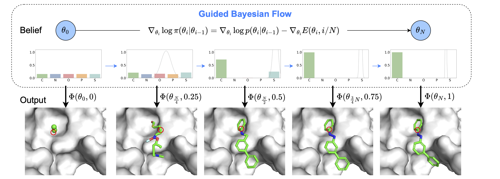

# MolJO
Official implementation of ICML 2025 ["Empower Structure-Based Molecule Optimization with Gradient Guided Bayesian Flow Networks"](https://arxiv.org/abs/2411.13280).



## Environment
It is highly recommended to install via docker if a Linux server with NVIDIA GPU is available.

Otherwise, you might check [README for env](docker/README.md) for further details of docker or conda setup.

### Prerequisite
A docker with `nvidia-container-runtime` enabled on your Linux system is required.

> [!TIP]
> - This repo provides an easy-to-use script to install docker and nvidia-container-runtime, in `./docker` run `sudo ./setup_docker_for_host.sh` to set up your host machine.
> - For details, please refer to the [install guide](https://docs.nvidia.com/datacenter/cloud-native/container-toolkit/latest/install-guide.html).


### Install via Docker
We highly recommend you to set up the environment via docker, since all you need to do is a simple `make` command.
```bash
cd ./docker
make
```

-----
## Data
We use the same CrossDock dataset as previous approaches with affinity info (Vina Score). Data used for training / evaluating the model is obtained from [KGDiff](https://github.com/CMACH508/KGDiff/tree/main?tab=readme-ov-file), and should be put in the `data` folder.

To train the property predictor from scratch, extract the files from the `data.zip` in [Zenodo](https://zenodo.org/records/8419944):
* `crossdocked_v1.1_rmsd1.0_pocket10_processed_final.lmdb`
* `crossdocked_pocket10_pose_split.pt`

To evaluate the model on the test set, download _and_ unzip the `test_set.zip` into `data` folder. It includes the original PDB files that will be used in Vina Docking.

---
## Training
```bash
python train_classifier.py --exp_name ${EXP_NAME} --revision ${REVISION} --prop_name ${PROPERTY} # affinity qed sa
```

where the other default values should be set the same as:
```bash
python train_bfn.py --config_file configs/train_prop.yaml --sigma1_coord 0.03 --beta1 1.5 --lr 5e-4 --time_emb_dim 1 --epochs 15 --max_grad_norm Q --destination_prediction True --use_discrete_t True
```

## Sampling
We provide the pretrained checkpoints for property predictors (Vina Score, SA) in the [pretrained](https://drive.google.com/drive/folders/12t90e-gHBbYn3tFOFIENZc0mZYFhZuX2?usp=share_link) Google Drive folder. The backbone checkpoint can be found [here](https://drive.google.com/file/d/1TcUQM7Lw1klH2wOVBu20cTsvBTcC1WKu/view?usp=share_link). After downloading them, please put the checkpoints under the `pretrained` folder.

### Sampling for pockets in the testset
```bash
python sample_guided.py --num_samples ${NUM_MOLS_PER_POCKET} --objective ${OBJ} # vina_sa
```

where the other default values should be set the same as:
```bash
python sample_guided.py --config_file configs/test_opt.yaml --pos_grad_weight 50 --type_grad_weight 50 --guide_mode param_naive --sample_steps 200 --sample_num_atoms prior
```

### Sampling from pdb file
To sample from a whole protein pdb file, we need the corresponding reference ligand to clip the protein pocket (a 10A region around the reference position).

```bash
python sample_for_pocket_guided.py --protein_path ${PDB_PATH} --ligand_path ${SDF_PATH}
```

## Evaluation

### Evaluating meta files
We provide our samples as `moljo_vina_sa_vina_docked_pose_checked.pt` in the [sample](https://drive.google.com/drive/folders/1A3Mthm9ksbfUnMCe5T2noGsiEV1RfChH?usp=sharing) Google Drive folder.


## Citation

```
@article{qiu2025empower,
  title={Empower Structure-Based Molecule Optimization with Gradient Guided Bayesian Flow Networks},
  author={Qiu, Keyue and Song, Yuxuan and Yu, Jie and Ma, Hongbo and Cao, Ziyao and Zhang, Zhilong and Wu, Yushuai and Zheng, Mingyue and Zhou, Hao and Ma, Wei-Ying},
  journal={ICML 2025},
  year={2025}
}
```
