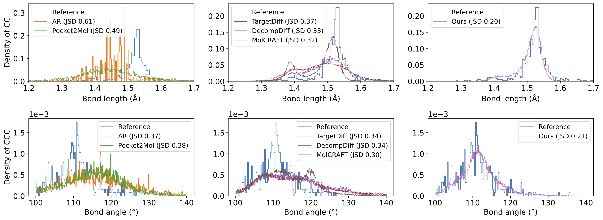

# MolPilot

[](https://huggingface.co/GenSI/MolPilot)
[](https://github.com/AlgoMole/MolCRAFT/tree/master)
[](https://MolCRAFT-GenSI.github.io/)
[](https://drive.google.com/drive/folders/16KiwfMGUIk4a6mNU20GnUd0ah-mjNlhC?usp=share_link)


Official implementation of ICML 2025 ["Piloting Structure-Based Drug Design via Modality-Specific Optimal Schedule"](https://arxiv.org/abs/2505.07286).


We propose VLB-Optimal Scheduling (VOS) and demonstrate its generality on the popular diffusion-based models (TargetDiff, with the code in `targetdiff` folder) and BFN-based models (our MolPilot). 

In fact, VOS can be easily integrated into other frameworks, with only minor changes w.r.t. training:

```python
# Example: TargetDiff molopt_score_model.py

class ScorePosNet3D(nn.Module):
  def get_diffusion_loss(...):
    ##### Original Training Loss #####
    time_step, pt = self.sample_time(num_graphs, protein_pos.device, self.sample_time_method)
    # Xt = a.sqrt() * X0 + (1-a).sqrt() * eps
    ligand_pos_perturbed = a_pos.sqrt() * ligand_pos + (1.0 - a_pos).sqrt() * pos_noise  # pos_noise * std

    ##### VOS Generalized Loss #####
    time_step_v, pt = self.sample_time(num_graphs, protein_pos.device, self.sample_time_method)
    # Vt = a * V0 + (1-a) / K
    log_ligand_v0 = index_to_log_onehot(ligand_v, self.num_classes)
    ligand_v_perturbed, log_ligand_vt = self.q_v_sample(log_ligand_v0, time_step_v, batch_ligand)
    kl_v = self.compute_v_Lt(log_v_model_prob=log_v_model_prob, log_v0=log_ligand_v0,
                             log_v_true_prob=log_v_true_prob, t=time_step_v, batch=batch_ligand)

```

The optimal test-time noise schedule can be obtained by first storing the gridded loss surface values, and then running the dynamic programming script in `test/test_geodesic_budget.py`.



## Environment
It is highly recommended to install via docker if a Linux server with NVIDIA GPU is available.

Otherwise, you might check [README for env](docker/README.md) for further details of docker or conda setup.

### Prerequisite
A docker with `nvidia-container-runtime` enabled on your Linux system is required.

> [!TIP]
> - This repo provides an easy-to-use script to install docker and nvidia-container-runtime, in `./docker` run `sudo ./setup_docker_for_host.sh` to set up your host machine.
> - For details, please refer to the [install guide](https://docs.nvidia.com/datacenter/cloud-native/container-toolkit/latest/install-guide.html).


### Install via Docker
We highly recommend you to set up the environment via docker, since all you need to do is a simple `make` command.
```bash
cd ./docker
make
```

-----
## Data
We preprocess the CrossDock data using `rdkit.Chem.Kekulize`, and provide the lmdb file and split file on [hugging face](https://huggingface.co/GenSI/MolPilot/tree/main). To train the model from scratch, download the lmdb file and split file into `data` folder:
* `crossdocked_v1.1_rmsd1.0_pocket10_processed_kekulize.lmdb`
* `crossdocked_pocket10_pose_split_kekulize.pt`

To process the training data from scratch, download `crossdocked_v1.1_rmsd1.0.tar.gz` from TargetDiff's [data](https://drive.google.com/drive/folders/1j21cc7-97TedKh_El5E34yI8o5ckI7eK) Google Drive folder, untar the files and run the scripts in `scripts/data_preparation` as described in [TargetDiff](https://github.com/guanjq/targetdiff/tree/main?tab=readme-ov-file#data), obtaining the `crossdocked_v1.1_rmsd1.0_pocket10` folder with pose split file. Then, simply run `python core/datasets/pl_pair_dataset.py` with the [version](https://github.com/AlgoMole/MolCRAFT/blob/master/MolPilot/core/datasets/pl_pair_dataset.py#L700) set to `kekulize`.

To evaluate the model on the test set, download _and_ unzip the `test_set.zip` from TargetDiff into data folder. It includes the original PDB files that will be used in Vina Dock.

```yaml
data:
  version: kekulize
```

---
## Training
```bash
python train_bfn_twisted.py --exp_name ${EXP_NAME} --revision ${REVISION} --config_file configs/crossdock_train_test.yaml  --time_decoupled
```

where the default values should be set the same as:
```bash
python train_bfn_twisted.py --sigma1_coord 0.05 --beta1 1.5 --beta1_bond 1.5 --lr 5e-4 --time_emb_dim 0  --self_condition --epochs 30 --batch_size 16 --max_grad_norm Q --scheduler plateau --destination_prediction True --use_discrete_t True --num_samples 10 --sampling_strategy end_back_pmf --sample_num_atoms ref --ligand_atom_mode add_aromatic
```

### Debugging
```bash
python train_bfn_twisted.py --no_wandb --debug --epochs 1
```

## Sampling
We provide the pretrained MolPilot checkpoint and config on [hugging face](https://huggingface.co/GenSI/MolPilot/tree/main). 

### Sampling for pockets in the testset
To sample for CrossDock, set the `CONFIG` to `configs/crossdock_train_test.yaml`. For PoseBusters, set it to `configs/posebusters_test.yaml`.

```bash
# Sample with time scheduler
python train_bfn_twisted.py --config_file ${CONFIG} --ckpt_path ${CKPT_PATH} --time_scheduler_path ${TIME_SCHEDULER} --test_only --exp_name ${EXP_NAME} --revision ${REVISION} --num_samples ${NUM_MOLS_PER_POCKET} --sample_steps 100 --eval_batch_size ${BATCH_SIZE}
```

### Sampling from pdb file
To sample from a whole protein pdb file, we need the corresponding reference ligand to clip the protein pocket (a 10A region around the reference position).

```bash
python sample_for_pocket.py --protein_path ${PDB_PATH} --ligand_path ${SDF_PATH} --time_scheduler_path ${TIME_SCHEDULER} --num_samples ${NUM_MOLS_PER_POCKET}
```

## Evaluation

### Evaluating meta files
We provide our samples as `molpilot_ref_vina_docked.pt` on CrossDock in the [sample](https://drive.google.com/drive/folders/1A3Mthm9ksbfUnMCe5T2noGsiEV1RfChH?usp=sharing) Google Drive folder.

<!-- TODO:, together with all the baseline results on PoseBusters in the [sample_posebusters]() folder. -->


## Citation

```
@article{qiu2025piloting,
  title={Piloting Structure-Based Drug Design via Modality-Specific Optimal Schedule},
  author={Qiu, Keyue and Song, Yuxuan and Fan, Zhehuan and Liu, Peidong and Zhang, Zhe and Zheng, Mingyue and Zhou, Hao and Ma, Wei-Ying},
  journal={ICML 2025},
  year={2025}
}
```
