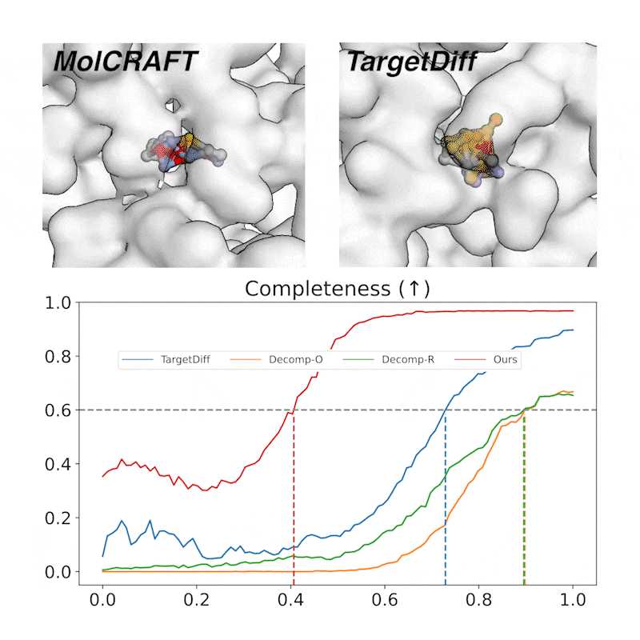
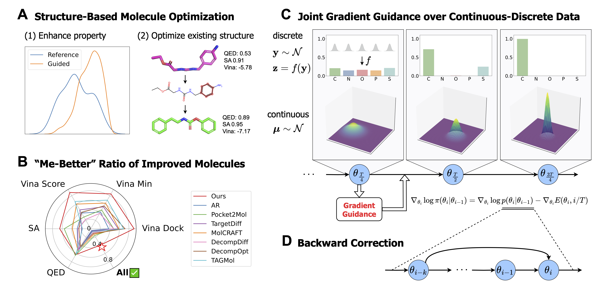
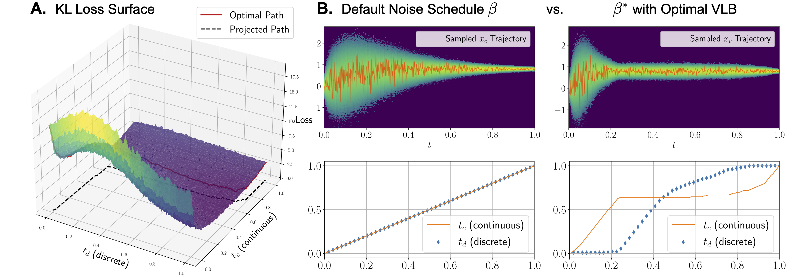

<div align='center'>
<h1> MolCRAFT Series for Drug Design </h1>

[](https://huggingface.co/GenSI/MolCRAFT/)
[](https://MolCRAFT-GenSI.github.io/)
[](https://drive.google.com/drive/folders/16KiwfMGUIk4a6mNU20GnUd0ah-mjNlhC?usp=share_link)

</div>


Welcome to the official repository for the MolCRAFT series of projects! This series focuses on developing and improving deep learning models for **structure-based drug design (SBDD)** and **molecule optimization (SBMO)**. Our goal is to create molecules with high binding affinity and plausible 3D conformations.

This repository contains the source code for the following projects:

* [**MolCRAFT**: Structure-Based Drug Design in Continuous Parameter Space](https://arxiv.org/abs/2404.12141) (ICML'24)
* [**MolJO**: Empower Structure-Based Molecule Optimization with Gradient Guided Bayesian Flow Networks](https://arxiv.org/abs/2411.13280) (ICML'25)
* [**MolPilot**: Piloting Structure-Based Drug Design via Modality-Specific Optimal Schedule](https://arxiv.org/abs/2505.07286) (ICML'25)

## 📜 Overview

The MolCRAFT series addresses critical challenges in generative models for SBDD, including modeling molecular geometries, handling hybrid continuous-discrete spaces, and optimizing molecules against protein targets. Each project introduces novel methodologies and achieves **state-of-the-art** performance on relevant benchmarks.

## 🧭 Navigation

| Folder                         | TL, DR               | Description                                                                                                                                                                                             |
| --------------------------- | --------------------- | ------------------------------------------------------------------------------------------------------------------------------------------------------------------------------------------------------ |
| [MolCRAFT](./MolCRAFT/)      | Unified Space for Molecule Generation  | MolCRAFT is the first SBDD generative model based on Bayesian Flow Network (BFN) operating in the unified continuous parameter space for different modalities, with variance reduction sampling strategy to generate high-quality samples with more than 10x speedup.
| [MolJO](./MolJO/)            | Gradient-Guided Molecule Optimization   | MolJO is a gradient-based Structure-Based Molecule Optimization (SBMO) framework derived within BFN. It employs joint guidance across continuous coordinates and discrete atom types, alongside a backward correction strategy for effective optimization.
| [MolPilot](./MolPilot/)      | Optimal Scheduling  | MolPilot enhances SBDD by introducing a VLB-Optimal Scheduling (VOS) strategy for the twisted multimodal probability paths, significantly improving molecular geometries and interaction modeling, achieving 95.9% PB-Valid rate.  |


---

## 🚀 Projects

### MolCRAFT (Let's Craft the Molecules)

<p align="center"></p>

* **Description**: MolCRAFT is the first SBDD model that employs BFN and operates in a **continuous parameter space**. It introduces a novel noise-reduced sampling strategy to generate molecules with superior binding affinity and more stable 3D structures. MolCRAFT has demonstrated its ability to accurately model interatomic interactions, achieving reference-level Vina Scores.
* **Key Contributions**:
    * Operates in continuous parameter space for SBDD within BFN framework.
    * Novel variance reduction sampling strategy that improves both sample quality and efficiency.
    * Achieves state-of-the-art binding affinity and structural stability.

---

### MolJO (Molecule Joint Optimization)



* **Description**: MolJO is a gradient-based SBMO framework that leverages a continuous and differentiable space derived through Bayesian inference. It facilitates **joint guidance signals across different modalities** (continuous coordinates and discrete atom types) while preserving SE(3)-equivariance. MolJO introduces a novel backward correction strategy for an effective trade-off between exploration and exploitation.
* **Key Contributions**:
    * Gradient-based SBMO framework with joint guidance across different modalities.
    * Backward correction strategy for optimized exploration-exploitation.
    * State-of-the-art performance in practical optimization tasks, including multi-objective and constrained optimization for R-group redesign, scaffold hopping, etc.

---

### MolPilot (How to Pilot the Aircraft)



* **Description**: MolPilot addresses challenges in geometric structure modeling by focusing on the **twisted probability path of multi-modalities** (continuous 3D positions and discrete 2D topologies). It proposes a VLB-Optimal Scheduling (VOS) strategy, optimizing the Variational Lower Bound as a path integral for SBDD. MolPilot significantly enhances molecular geometries and interaction modeling.
* **Key Contributions**:
    * Addresses multi-modality challenges in SBDD.
    * Introduces VLB-Optimal Scheduling (VOS) strategy, generally applicable to a wide range of frameworks including diffusions.
    * Achieves 95.9% PoseBusters passing rate on CrossDock with significantly improved molecular geometries.

---

## ⚙️ Installation & Usage

Please refer to the `README.md` file within each project's subdirectory for specific instructions on installation, dependencies (docker recommended), and how to run the code.

---

## 📊 Datasets and Benchmarks

Our models are evaluated on standard benchmarks in the field, such as:

* **CrossDocked2020**: Used for evaluating binding affinity, molecular validity, and optimization success rates.
* **PoseBusters V2**: Used for assessing the quality of generated molecular poses.

Details about the specific datasets used for training and evaluation can be found in the respective publications and project READMEs.

---

## 🤝 Contributing

We welcome contributions to the MolCRAFT series! If you are interested in contributing, please feel free to fork the repository, make your changes, and submit a pull request. You can also open an issue if you find any bugs or have suggestions for improvements.

---

## 📝 Citation

If you use any of the methods or code from this repository in your research, please cite the respective papers:

```bibtex
@article{qiu2025piloting,
  title={Piloting Structure-Based Drug Design via Modality-Specific Optimal Schedule},
  author={Qiu, Keyue and Song, Yuxuan and Fan, Zhehuan and Liu, Peidong and Zhang, Zhe and Zheng, Mingyue and Zhou, Hao and Ma, Wei-Ying},
  journal={ICML 2025},
  year={2025}
}

@article{qiu2025empower,
  title={Empower Structure-Based Molecule Optimization with Gradient Guided Bayesian Flow Networks},
  author={Qiu, Keyue and Song, Yuxuan and Yu, Jie and Ma, Hongbo and Cao, Ziyao and Zhang, Zhilong and Wu, Yushuai and Zheng, Mingyue and Zhou, Hao and Ma, Wei-Ying},
  journal={ICML 2025},
  year={2025}
}

@article{qu2024molcraft,
  title={MolCRAFT: Structure-Based Drug Design in Continuous Parameter Space},
  author={Qu, Yanru and Qiu, Keyue and Song, Yuxuan and Gong, Jingjing and Han, Jiawei and Zheng, Mingyue and Zhou, Hao and Ma, Wei-Ying},
  journal={ICML 2024},
  year={2024}
}

@article{song2024unified,
  title={Unified Generative Modeling of 3D Molecules via Bayesian Flow Networks},
  author={Song, Yuxuan and Gong, Jingjing and Qu, Yanru and Zhou, Hao and Zheng, Mingyue and Liu, Jingjing and Ma, Wei-Ying},
  journal={ICLR 2024},
  year={2024}
}
```

## 📄 License 

The project is licensed under the terms of the CC-BY-NC-SA license. See [LICENSE](https://github.com/algomole/MolCRAFT/blob/main/LICENSE) for more details.
